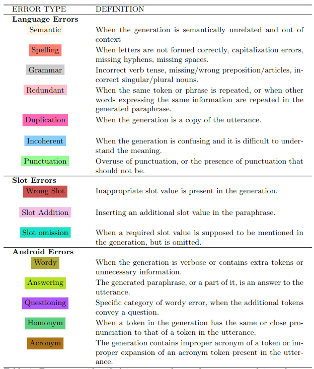

# About
Contains datasets and code for the paper "Error types in Transformer-based Paraphrasing Models: A Taxonomy, Paraphrase Annotation Model and Dataset". 

## Table of Contents
- [SNIPS Folder](#snips-folder)
- [Generated Paraphrases](#generated-paraphrases)
- [GPT Paraphrasing](#gpt-paraphrasing)
- [Appendices](#appendices)
- [TPME Dataset](#tpme-dataset)
- [BERT Finetuning](#finetuned-model)
- [UpSet Plot](#upset-plot)
- [Possible use cases](#possible-use-cases)
- [More information](#more-information)

# SNIPS Folder
This folder contains the code to extract seed utterances from raw SNIPS JSON snippets retrieved from the [SNIPS][snips] dataset (described in Section 2.2).

# Generated Paraphrases
This folder contains the generated paraphrases described in Section 2 of our paper. There are 22864 generated paraphrases for 598 seed utterances. The generated paraphrases are grouped into 8 datasets based on the model used to generate them and the intent of the seed utterances.

# GPT Paraphrasing
Within this folder, you will find the data, prompt and code used for generating paraphrases with GPT-3.5-turbo.

<div align="center">


</div>

# Appendices
This folder contains two appendices documenting sampled errors:
- Appendix A: This document contains paraphrases with errors categorized by type of error. Each paraphrase is annotated with an error label.
- Appendix B: This document contains sample paraphrases labeled with different errors. This document illustrates the co-occurrence of several errors in the same paraphrase.

# TPME Dataset
A dataset of annotated paraphrases. The *Transformer-based Paraphrasing Model Errors (TPME)* dataset consists of 5880 annotated paraphrases, where the paraphrases have been labeled with a series of errors and explanations(sentence in simple natural English that justifies the error label). Each paraphrase is annotated with at least one of the following labels:
- Correct
- Semantic
- Spelling
- Grammmar
- Redundant
- Duplication
- Incoherent
- Punctuation
- Wrong Slot
- Slot Addition
- Slot omission
- Wordy
- Answering
- Questioning
- Homonym
- Acronym


<div align="center">



</div>

<div align="center">


</div>


## Finetuned Model
Within this directory, you will find the necessary code and data utilized for fine-tuning a BERT model specifically tailored for the multi-labeling task using the TPME dataset.

**Usage:**
To initiate the fine-tuning process, simply execute the `bert_multi_labeling.py` script using the following command:

```bash
python bert_multi_labeling.py -f data.csv
```
This command is designed to run the script, leveraging the data.csv file as input for the multi-labeling task.

## Upset Plot
Within this directory, you will find the necessary code and data needed to generate the UpSet plot using the Intervene platform for the TPME dataset.

## Possible use cases
- Automatic Paraphrasing errors Detection
- Paraphrase Generation
- Training data for Chatbots
- Entity recognition


## More information
You can contact me via audayberro (at) gmail.com

For more information please refer to our paper. Please also cite the following paper if you are using the dataset in your research:

```sh
@inproceedings{loremipsumdolor,
  title={Error types in Transformer-based Paraphrasing Models: A Taxonomy, Paraphrase Annotation Model and Dataset},
  author={Berro, Auday and Benatallah, Boualem and Gaci, Yacin and Benabdeslem, Khalid},
  year={2024}
```

[snips]: <https://github.com/snipsco/snips-nlu>
